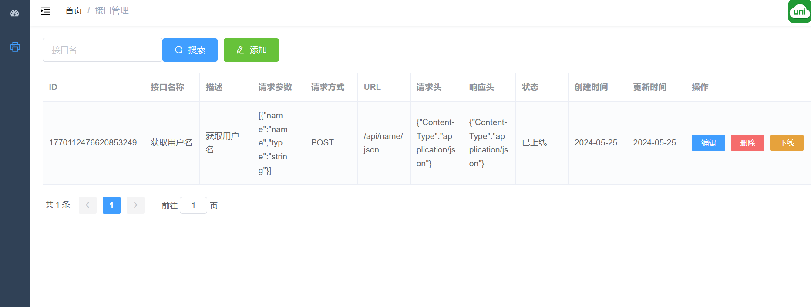
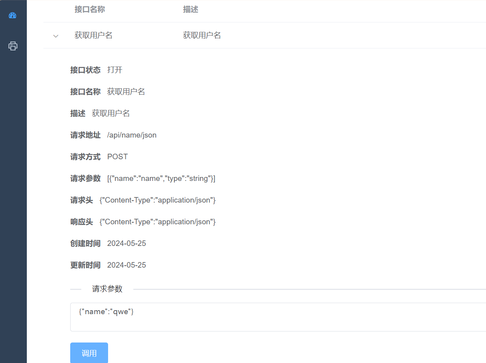
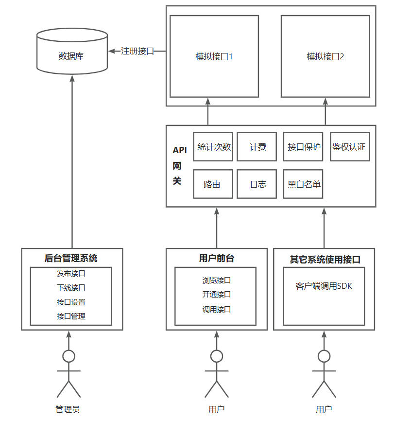

## 项目介绍

​		智桥API开放平台是一种允许外部开发者访问和使用特定服务或应用功能的在线平台。该平台汇总了来自不同提供商的API接口，涵盖了广泛的技术和应用领域，为开发者提供一站式发现和试用API的能力。项目基于Vue2 + SpringBoot + Dubbo + Gateway。管理员可以接入并发布接口，可视化各接口调用情况；用户可以开通接口调用权限、浏览接口及在线调用调试，并通过客户端SDK轻松调用接口。

## 技术栈

### 前端

- Vue-Element-Admin 
- Vue 
- Element-UI
- Axios

### 后端

- Spring Boot2.7
- MyBatis Plus
- Dubbo RPC
- Spring Cloud Gateway
- Sentinel

## 项目功能

### 接口管理

### 接口测试

## 架构设计

